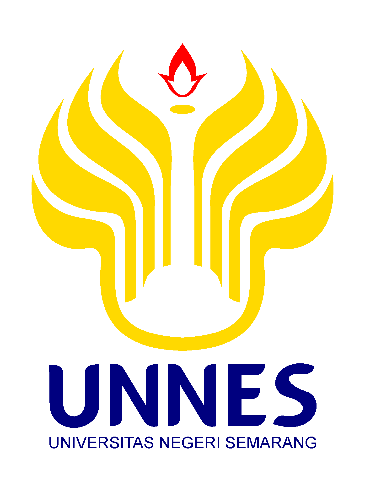
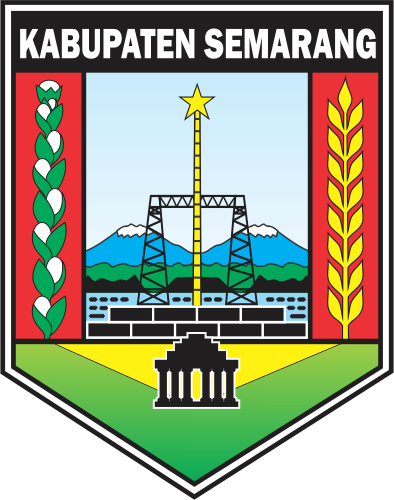

# 🌐 CatatKas UMKM Web Landing Page

<p align="center">
  
  &nbsp;&nbsp;&nbsp;&nbsp;&nbsp;&nbsp;&nbsp;&nbsp;
  
</p>

<p align="center">
  <b>Situs Web Unduhan Resmi Aplikasi CatatKas UMKM Desa Manggihan</b><br/>
  Program Pengabdian KKN GIAT 16 Universitas Negeri Semarang (UNNES)
</p>

<p align="center">
  
  
  
  
</p>

---

## 📌 Mengenai CatatKas Web

Repositori ini berisi kode sumber untuk **Situs Web Landing Page** aplikasi CatatKas UMKM. Web ini dirancang secara khusus untuk mempromosikan dan mendistribusikan file APK aplikasi *mobile* CatatKas secara langsung kepada pengguna, tanpa perlu melalui Google Play Store.

## ✨ Fitur-Fitur Utama

- 📱 **Interactive App Mockup**
  Pratinjau langsung UI aplikasi Flutter (Beranda dan Splash Screen) yang direplikasi secara presisi menggunakan murni HTML dan CSS.
- ⚡ **Simulasi Ketik Cepat**
  Pengunjung dapat mencoba simulasi cerdas fitur "Ketik Cepat Transaksi" secara *real-time* dari *browser*.
- 📥 **Direct APK Download**
  Tautan unduh otomatis ke file `CatatKas_UMKM.apk` dengan satu klik.
- 🚀 **Performa Tinggi & Ringan**
  Dibangun menggunakan Vite dan React tanpa manajemen *state* berat, sehingga memuat halaman dengan sangat instan.
- 📱 **Desain Responsif**
  Tampilan yang dapat menyesuaikan dengan rapi di perangkat desktop, tablet, maupun seluler.

---

## 🚀 Panduan Menjalankan Lokal

### Prasyarat:
- [Node.js](https://nodejs.org/) (versi 16 atau lebih baru)
- npm / yarn / pnpm

### Langkah-Langkah:

1. **Clone Repositori**:
   ```bash
   git clone https://github.com/imanyunar/catatkas-web.git
   cd catatkas-web
   ```

2. **Install Dependensi**:
   ```bash
   npm install
   ```

3. **Jalankan Server Development**:
   ```bash
   npm run dev
   ```
   *Buka `http://localhost:5173` di browser Anda.*

4. **Build untuk Produksi**:
   ```bash
   npm run build
   ```
   *Hasil build statis akan tersimpan di dalam folder `dist/`.*

---

## 🌐 Deployment (GitHub Pages)

Proyek ini telah dikonfigurasi untuk otomatis dapat di-*deploy* ke Github Pages menggunakan *library* `gh-pages`.
Untuk menerbitkan pembaruan versi terbaru ke internet, Anda cukup menjalankan:

```bash
npm run deploy
```

---

## 👨‍💻 Kontributor & Tim Pengembang

Aplikasi dan Web ini dikembangkan sebagai bagian dari program kerja pengabdian masyarakat **GIAT 16 Universitas Negeri Semarang (UNNES)** di **Desa Manggihan, Kabupaten Semarang**.

- **Tim Pengembang**: UNNES GIAT 16 Desa Manggihan
- **Aplikasi Mobile (Flutter)**: [imanyunar/KasKu](https://github.com/imanyunar/KasKu)
- **Web Landing Page**: [imanyunar/catatkas-web](https://github.com/imanyunar/catatkas-web)

---

<p align="center">
  <i>Situs web ini didedikasikan untuk kemudahan akses teknologi bagi UMKM Desa Manggihan.</i>
</p>
